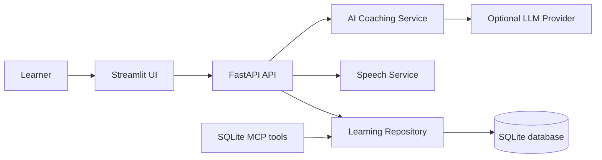

# English Learning Companion AI

English Learning Companion AI is a production-shaped, voice-first learning workspace for children aged 2-5 and the grown-ups helping them. It holds a playful conversation, offers one tiny language model per turn, tracks useful words in SQLite, and turns that history into practice suggestions and progress charts.

The default `rule_based` coach runs fully offline. The optional OpenAI-compatible provider also supports OpenAI, GitHub Models, Azure OpenAI, and compatible endpoints through environment variables.

## Architecture



## Features

- Playful English conversation for ages 2-5 with short, familiar words and one simple question at a time.
- A broad language picker backed by the installed gTTS/Google language catalog, with native-language labels and speech codes.
- Exactly one grammar, vocabulary, or sentence-structure correction per response.
- SQLite tables for vocabulary, conversations, and learner progress.
- Automatic vocabulary extraction and repeat-use frequency tracking.
- Plotly dashboard for daily activity, new words by week, correction history, and frequently used words.
- Browser recording to server-side speech-to-text, plus on-demand text-to-speech with voice and speed controls.
- An interactive Three.js 3D word world with draggable shapes for colors, play, and everyday words.
- A real stdio MCP server with vocabulary and progress tools.
- UTF-8 write protections at the HTTP, service, repository, file, and pre-commit boundaries.

## Project Layout

```text
app/
	api/            FastAPI routes, dependencies, and UTF-8 middleware
	database/       SQLite connection, repository, schema.py, and schema.sql
	models/         Pydantic request and response models
	prompts/        LLM system prompt
	services/       AI coaching, vocabulary extraction, practice, UTF-8 guard
	speech/         Speech-to-text and text-to-speech service
	ui/             Streamlit learner interface and styling
	mcp_server.py   Stdio SQLite MCP server
data/             Runtime SQLite database location
logs/             UTF-8 application logs
scripts/          Database initialization and UTF-8 hook utility
tests/            Unit, API, MCP, speech, and UI smoke tests
```

## Local Setup

Use Python 3.12 or newer.

```bash
python3 -m venv .venv
.venv/bin/python -m pip install --upgrade pip
.venv/bin/python -m pip install -r requirements.txt
cp .env.example .env
.venv/bin/python scripts/initialize_database.py
```

Start both services together with the lifecycle-safe launcher:

```bash
./run.sh
```

It waits for both services, opens the UI in Chrome, prints the UI and API URLs, and stops both child processes together when you press `Ctrl+C`. If `8000` or `8501` is already occupied, it automatically chooses the next free local port and passes the selected API URL into Streamlit. This makes repeated launches safe even when an older browser session is still open.

For separate terminals, start the backend:

```bash
.venv/bin/uvicorn main:app --reload --host 127.0.0.1 --port 8000
```

Start the learner UI in another:

```bash
.venv/bin/streamlit run app/ui/streamlit_app.py --server.port 8501
```

Open `http://127.0.0.1:8501`. FastAPI interactive documentation is available at `http://127.0.0.1:8000/docs`.

## Languages and Web-Sourced Catalog

The language picker is populated from the language catalog shipped by gTTS, which documents Google Translate speech language tags and localized accents: [gTTS language documentation](https://gtts.readthedocs.io/en/latest/module.html#languages-gtts-lang). The current installed catalog contains 69 speech languages, including English, Spanish, French, German, Hindi, Bengali, Arabic, Mandarin, Japanese, Korean, Tamil, Telugu, Marathi, Urdu, Swahili, Filipino, and many more.

The app keeps a local cached catalog so the UI can boot offline. The optional remote AI provider receives the selected language code in its system prompt and can converse in that language; the local fallback has child-friendly phrase coverage for common languages and uses the selected speech voice for every catalog language.

The live API exposes the same data at `GET /api/languages`.

## Voice and 3D Demo

The `Talk & Play` screen is voice-first for ages 2-5:

1. Pick a practice language in the grown-up settings.
2. Tap the microphone and record a short phrase.
3. Press `Send my voice` to transcribe it.
4. The coach answers and automatically prepares audio in the selected language.
5. Use `Hear it` to replay any answer.

Expand `Explore the 3D word world` to drag and tap the Three.js shapes. The demo loads Three.js from its public CDN; the core chat, database, and speech API remain available if that visual CDN is unavailable.

## AI Provider Configuration

Copy `.env.example` to `.env`. The default local option needs no key:

```dotenv
LLM_PROVIDER=rule_based
```

For an OpenAI-compatible provider, set the provider, API key, model, and endpoint:

```dotenv
LLM_PROVIDER=openai_compatible
OPENAI_API_KEY=replace-with-a-secret
OPENAI_MODEL=gpt-4o-mini
OPENAI_BASE_URL=https://api.openai.com/v1
```

For GitHub Models or Azure OpenAI, use the matching provider label (`github_models` or `azure_openai`) and their compatible endpoint/model settings. If a remote request fails or returns invalid JSON, the app records the turn using the local coach rather than breaking the learning session.

## SQLite and MCP

The database is automatically initialized at `data/vocabulary.db`. Its schema is stored in [app/database/schema.sql](app/database/schema.sql).

The VS Code configuration in [.vscode/mcp.json](.vscode/mcp.json) starts `app.mcp_server` using the project virtual environment. It exposes these tools:

- `get_vocabulary(limit)`
- `add_word(word, meaning, example_sentence)`
- `update_frequency(word, increment)`
- `get_progress()`
- `save_conversation(user_message, ai_response, correction)`

Each tool uses the same repository and UTF-8 guard as the web application.

## UTF-8 Protection

All text writes are validated by `validate_utf8_text` before a conversation, correction, vocabulary word, speech transcript, or text file reaches persistence. The FastAPI middleware rejects malformed UTF-8 JSON before request parsing; repository methods use parameterized SQL; and failures are logged in `logs/application.log` using UTF-8 encoding.

Install the optional staged-file pre-commit hook:

```bash
git config core.hooksPath .githooks
```

The hook validates staged source and configuration files via `scripts/validate_utf8_files.py`. It rejects non-UTF-8 and binary-control content before it can be committed.

## Speech Notes

Streamlit provides the microphone capture control. Speech-to-text uses the SpeechRecognition Google backend and accepts short WAV recordings; text-to-speech uses gTTS. Both integrations require network access and fail with a clear, recoverable API response when disabled or unavailable. Audio remains in memory and is never stored in SQLite.

## Tests and Quality Gate

```bash
.venv/bin/python -m pytest --cov --cov-report=term-missing
```

The configured backend coverage threshold is 85%. The Streamlit view is excluded from line coverage because it is exercised through Streamlit's UI test runner and live browser smoke testing.

## Docker

Build and start both services:

```bash
docker compose up --build
```

The Streamlit UI is served on `http://localhost:8501`, while FastAPI is on `http://localhost:8000`. Docker Compose uses named volumes for SQLite data and application logs. For deployment, place the API behind TLS, set production values through the host environment or a secrets manager, retain the SQLite volume, and replace the default CORS list with the deployed UI origin.

## Push to GitHub

The supplied URL `https://github.com/amittlearnings007` is an account profile, not a repository. `push.sh` defaults to creating and pushing to:

```text
https://github.com/amittlearnings007/english-learning-companion-ai
```

Authenticate once with GitHub CLI, then run:

```bash
gh auth login
./push.sh
```

To use another repository name or an existing repository URL:

```bash
./push.sh my-repository
./push.sh https://github.com/amittlearnings007/my-repository.git
```

The script creates a commit, configures `.githooks` for UTF-8 validation, creates the public repository when `gh` is available, and pushes `main`. It does not read or write API tokens.
